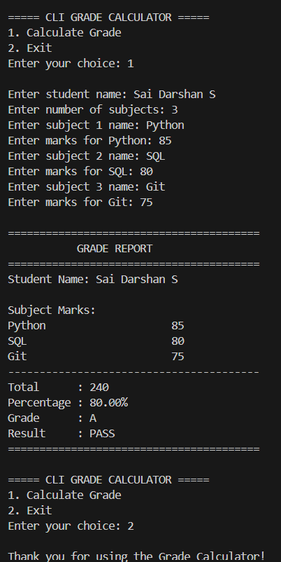

# CLI Grade Calculator

A simple command-line grade calculator built using Python. The program allows users to enter a student's name, number of subjects, and marks, then calculates the total, percentage, grade, and result.

## Features

* Menu-driven command-line interface
* Enter any number of subjects
* Store subject names and marks using a dictionary
* Calculate total marks and percentage
* Automatically assign grades
* Display Pass/Fail result
* Validate subject names and marks
* Handle invalid numerical input using exception handling

## Grading System

| Percentage | Grade |
| ---------- | ----- |
| 80–100     | A     |
| 65–79      | B     |
| 50–64      | C     |
| 40–49      | D     |
| Below 40   | F     |

## Python Concepts Used

* Functions
* Dictionaries
* `for` and `while` loops
* `if/elif/else`
* User input
* Exception handling
* Basic arithmetic operations
* String formatting

## How to Run

Make sure Python is installed, then run:

```bash
python code.py
```

## Output


